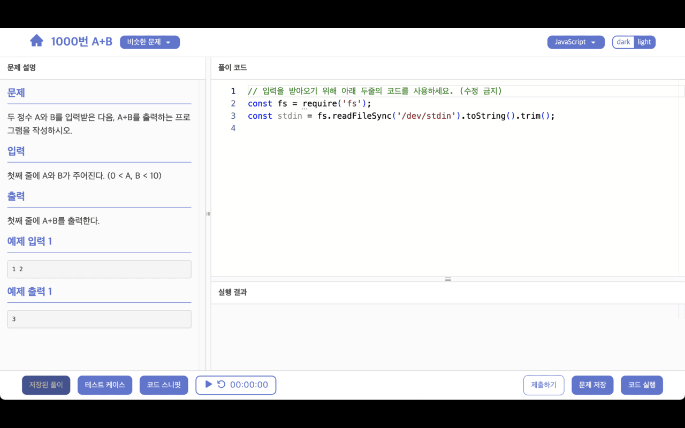

# BOJ Helper Extension

<https://boj-helper.vercel.app>

BOJ Helper Extension은 백준 온라인 저지(BOJ) 문제 페이지에 boj-helper 사이트로 빠르게 이동할 수 있는 바로가기 버튼을 추가해 주는 크롬 확장 프로그램입니다.
이 확장 프로그램을 통해 코딩 에디터와 문제 설명을 제공하는 boj-helper 사이트로 쉽게 접근할 수 있습니다.

## 주요 기능

- 백준 문제 페이지에 JavaScript와 Python 제출 버튼 추가

    
    

- boj-helper 사이트로 빠르게 이동하여 문제 해결에 도움을 줌

    
  
